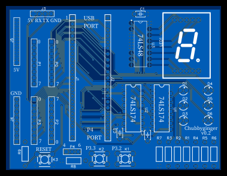

# C51-TrafficLight
8051红绿灯demo，有行人过街按钮功能

## 硬件部分
主控MCU为STC89C52，为了方便直接买了核心板（Fos44）

单片机IO口全部引出，板子可兼做8051实验板。全过孔，新手可焊。

板上资源：STC89C52单片机一片，一位数码管一个，数码管译码器74LS48一片，红灯绿灯黄灯LED各两个，按钮两个（接int0和int1，可以进行中断实验），74LS174 D触发器2片12个（4个接译码器，2个空着没用，6个接在单片机io口上）。

PCB是嘉立创eda画的，有点不习惯，以前一直用KiCad。

下面这张板子是第一版的，漏加了三个去耦电容，三个上下拉电阻，两个按键的丝印画反了，另外RESET的上下拉接反了所以这一版RESET键不起作用。当时课题组急着让我交PCB好去打板，所以有的地方没仔细看就打了。上述问题第二版已修复。另外，旧版的LED灯有点暗，第二版将LED灯限流电阻改小了，会亮一些。但要注意第二版还没验证，不保证一定能用。

成品如下

## 软件部分
逻辑：开机默认显示车行道绿灯，人行道红灯。按下P3.2按钮，开始倒计时，倒计时结束后车行道变黄灯→红灯，人行道变绿灯，开始倒计时，倒计时结束后人行道变红灯，车行道变绿灯，回到默认状态。

FSM实现，大概两百行，抄了一些STC的例程。IDE用的~~礦ision~~ Keil5

代码中有一些UART相关的部分，仅供调试用，是可以删除的。

配套有一个proteus文件，可以用于模拟、调试。

## 制作方法
1. 硬件：数码管一定要最后一个焊接。U2、D5、P0~P4、J4~J5、R8、K2和红绿灯无关可以不装。
   
   注意！！核心板一定要USB口朝上，P4口朝下！装错了无法使用。
2. 软件：用STC ISP下载hex文件即可。核心板自带CH340，所以可以不用板上的UART接口下载。下载时，先点击ISP软件编程按钮，然后按一下板子上的RESET键（或者把核心板上电源开关关掉再打开一次）即可开始下载。